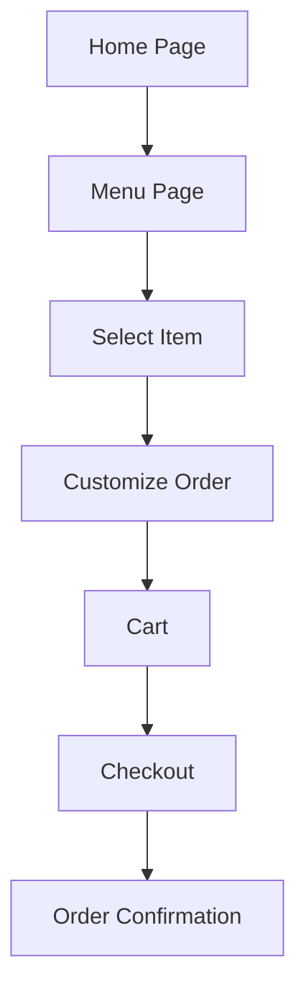

# ☕ Cafe Website

Discover the perfect blend of **simplicity and functionality** with our café website.  
Browse the menu, customize your order, and enjoy a seamless checkout experience.  

👉 **Live Demo:** [Cafe Website](https://thecosmicwizard.github.io/Cafe-Website/)

-----

## 🛠️ Tech Used
- **HTML5** – structure  
- **CSS3** – styling & responsiveness  
- **JavaScript (ES6)** – interactivity & logic  

---

## 🔄 Flow Chart

---

# 🚀 Features
 - Clean & responsive UI
 - Menu browsing with item details
 - Order customization
 - Cart & checkout flow
---
## 📌 How to Run
```bash
# Clone repo
git clone https://github.com/TheCosmicWizard/Cafe-Website.git
cd Cafe-Website

# Open index.html in browser
```
## 📄 License

This project is licensed under the MIT License – free to use, modify, and distribute.

